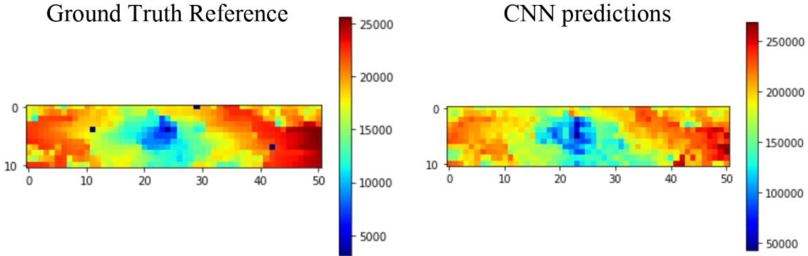

This repository contains parts of the code implemented for my project:
# Comparison of local vs global geological data for Reservoir oil recovery forecasting

In this work, I studied how geological properties such as rock porosity and permeability can help a Convolution Neural Network capture effect of an injector well on a producer well seperated by large distance in a reservoir. My research extends the work of [1]. While the method in [1] uses local geological data around an infill well, I focus on the global data that spans the complete reservoir.

The repository contains the following files:
- Open Porus Media (OPM) / ECLIPSE reservoir simulation files based on the SPE10 Model 2
- `python` files to run OPM for varying infill well locations (`data_collect.py`)
- `python` files for Data Pre-processing and Analysis.
- I provide my PyTorch implementation of the Convolution Neural Network based on [1], to predict total oil production after 20 years given any infill well location : `Training/training.ipynb`, `Testing/testing.ipynb`
- A jupyter notebook file which compares CNN production heat map with the reference production heat map (Ground truth) for [1]: `Reference/reference_comparison.ipynb`
- *I plan to make the report and the full-source code public soon*.

### Production Heatmaps for Reference and CNN model

[1] Chu, Min-gon, et al. "Determination of an infill well placement using a data-driven multi-modal convolutional neural network." Journal of Petroleum Science and Engineering 195 (2020): 106805.
